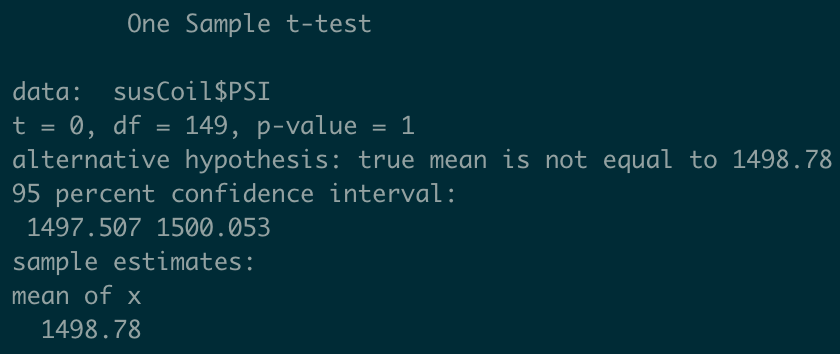
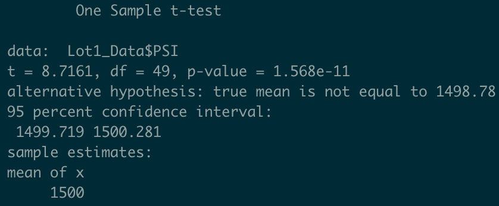
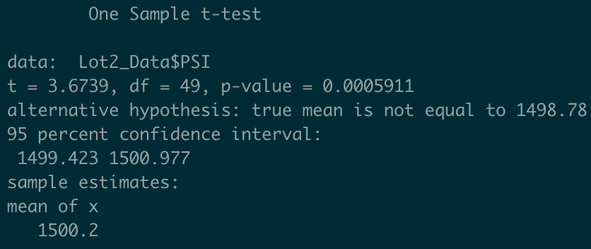
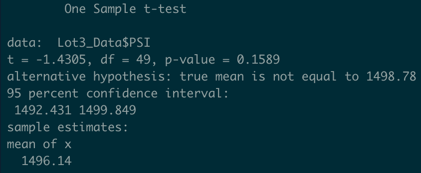

# MechaCar Statistical Analysis

## Project Overview

AutosRUs management needs production data reviewed by the analytics team in order to gain new insights that may help the manufacturing team.

## Resources

- Data Source: MechaCar_mpg.csv, Suspension_Coil.csv
- Software: R Studio 2022.02.3 Build 492

## Results

### Linear Regression to Predict MPG
1. Which variables/coefficients provided a non-random amount of variance to the mpg values in the dataset?
  - The vehicle-length and ground_clearance coefficients both have a p-values of less than 0.05%.
2. Is the slope of the linear model considered to be zero? Why or why not?
  - The slope of this linear model is not zero due to the p-value being 5.35e-11, which allows the null hypothesis to be rejected.
3. Does this linear model predict mpg of MechaCar prototypes effectively? Why or why not?
  - Yes, this linear model predicts mpg of MechaCar prototypes effectively. The reasoning is because the R-squared value is 0.7149, which means roughly 71% of the variablility of our dependent variable is explained using this model. Also, the p-value is far less than 0.05% which gives us great confidence in rejecting the null hypothesis.

See below for the summary statistics:

### Summary Statistics on Suspension Coils
1. The design specifications for the MechaCar suspension coils dictate that the variance of the suspension coils must not exceed 100 pounds per square inch. Does the current manufacturing data meet this design specification for all manufacturing lots in total and each lot individually? Why or why not?
  - The variance does not exceed the 100 PSI limit in total, coming in at ~62 PSI variance. Lot 1 and Lot 2 are both well below the 100 PSI limit, but Lot 3 has a variance of ~170 PSI, which is most certainly affecting the total lot variance.

See below for the total and per lot summary statistics:

### T-Tests on Suspension Coils
The t-test that compares all of the lot PSI data against the population mean PSI shows that the data is identical. This claimn is supported by the p-value of 1. The t-test for Lot 1 indicates that the values are not significantly different which is supported by a p-value of 1.568e-11. The Lot 2 t-test also shows that the data isn't very significant due to the p-value of 0.0005911. The Lot 3 t-test on the other hand shows that the PSI data is significantly different due to having a p-value of .1589, which is much larger than the 0.05 threshold.

See below for the t-test reults:

### Study Design: MechaCar vs Competition
1. What metric or metrics are you going to test?
  - The metrics used would be horsepower, torque (ft/lbs), maximum RPM, and combined MPG.
2. What is the null hypothesis or alternative hypothesis?
  - Null hypothesis: Horsepower, torque, and RPM figures have no affect on combined MPG between the MechaCar and the competition.
  - Alternative hypothesis: Having higher horsepower, torque, and RPM figures in the MechaCar compared to the competition negatively affects the MPG of the MechaCar.
3. What statistical test would you use to test the hypothesis? And why?
  - Testing correlations between horsepower, torque, and max RPM against mpg and comparing it to the same test done to competiton.
4. What data is needed to run the statistical test?
  - horsepower, torque (ft/lbs), max RPM, and combined MPG data for both MechaCars and the competition will be needed.

