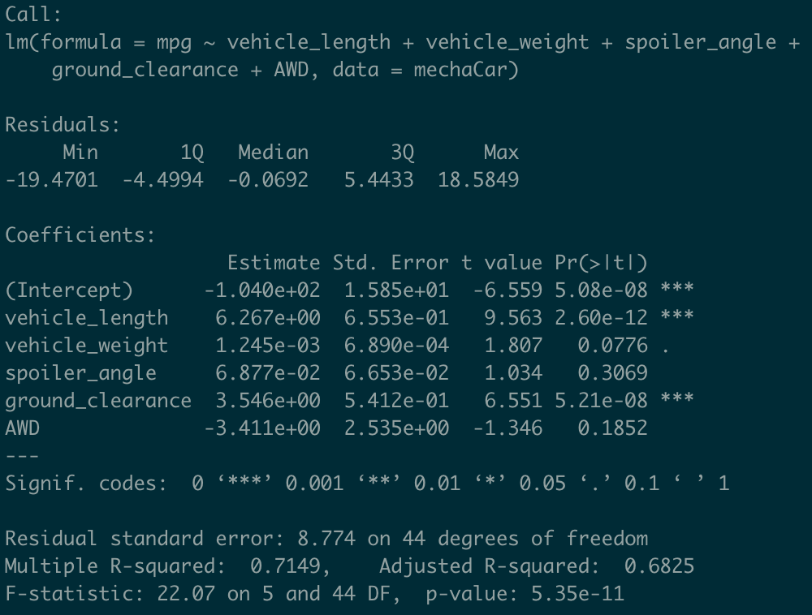

# MechaCar Statistical Analysis with R

## Project Overview

## Resources

## Results

### Linear Regression to Predict MPG
1. Which variables/coefficients provided a non-random amount of variance to the mpg values in the dataset?
  - The vehicle-length, ground_clearance, and Intercept coefficients all have a p-values of less than 0.05%
2. Is the slope of the linear model considered to be zero? Why or why not?
  - The slope of this linear model is not zero due to the p-value being 5.35e-11, which allows the null hypothesis to be rejected.
3. Does this linear model predict mpg of MechaCar prototypes effectively? Why or why not?
  - Yes, this linear model predicts mpg of MechaCar prototypes effectively. The reasoning is because the R-squared value is 0.7149, which means roughly 71% of the variablility of our dependent variable is explained using this model. Also, the p-value is far less than 0.05% which gives us great confidence in rejecting the null hypothesis.

See below for the summary statistics:

### Summary Statistics on Suspension Coils

### T-Tests on Suspension Coils

### Study Design: MechaCar vs Competition
